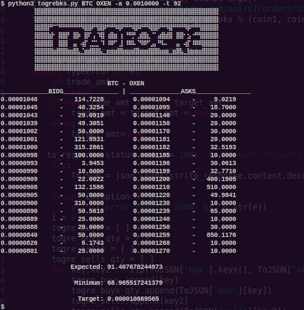

# togrebks
TradeOgre Order Books for Trading Pair

# Install
`pip install requests`

`pip install json`

## Alerts

`apt install alsa-utils`

# Usage
`$ python togrebks.py coin1 coin2`


```
$ python3 togrebks.py --help
usage: togrebks.py [-h] [-a amount] [-t target] coin [coin ...]

TradeOgre - Order Books for Trading Pair

positional arguments:
  coin                  e.g python3 togrebks.py BTC XMR

optional arguments:
  -h, --help            show this help message and exit
  -a amount, --amount amount
                        Enter Amount Wanting to Trade
  -t target, --target target
                        Target Amount Wanting to Receive
```

## Alerts
Will loop a non-annoying alarm sound to let you know your target has been reached. 

## Example

`$ python3 togrebks.py BTC OXEN -a 0.0010000 -t 92`

Output:




## Useful 
`watch -n 10 'python3 togrebks.py BTC XMR'`
